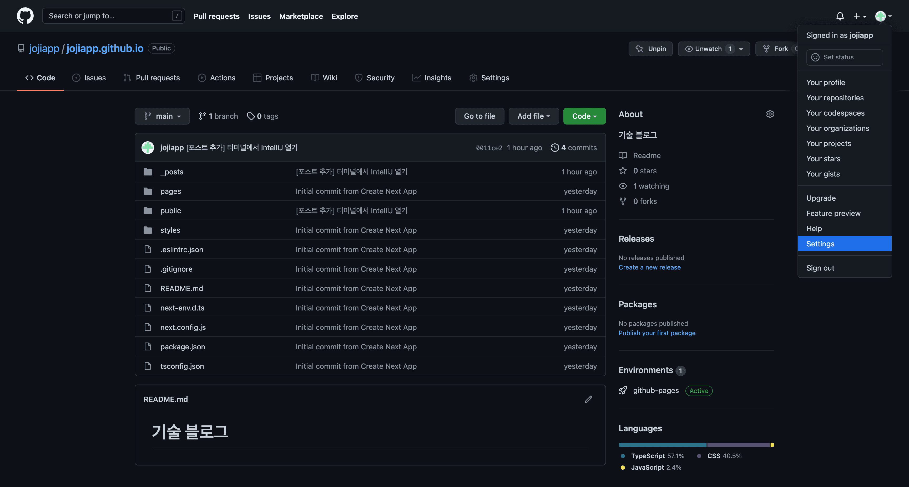
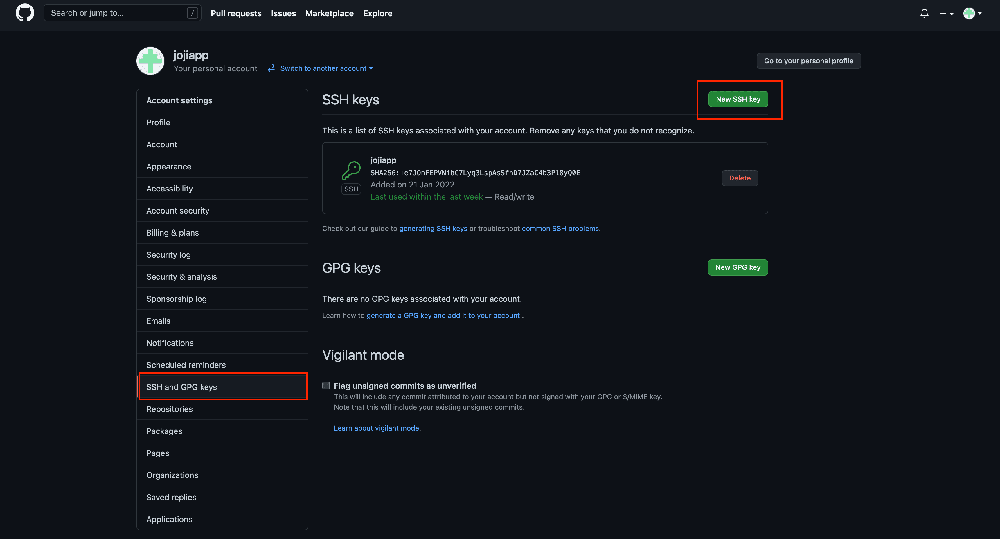
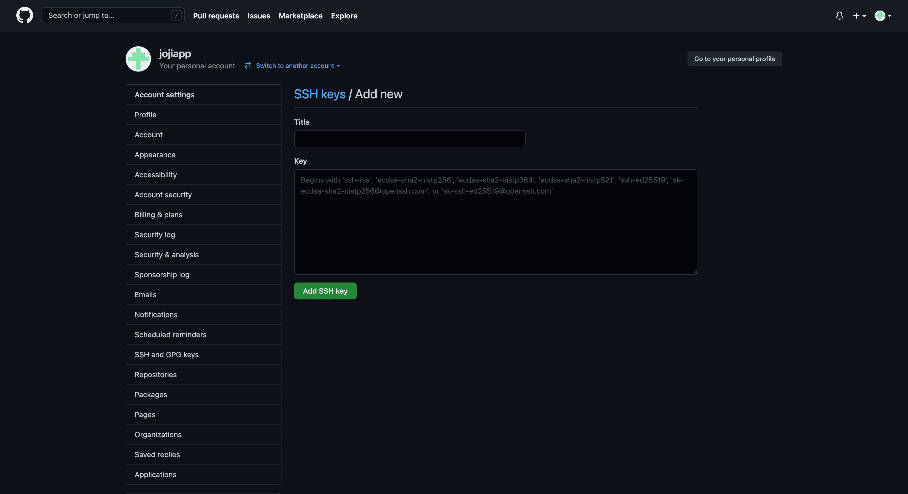
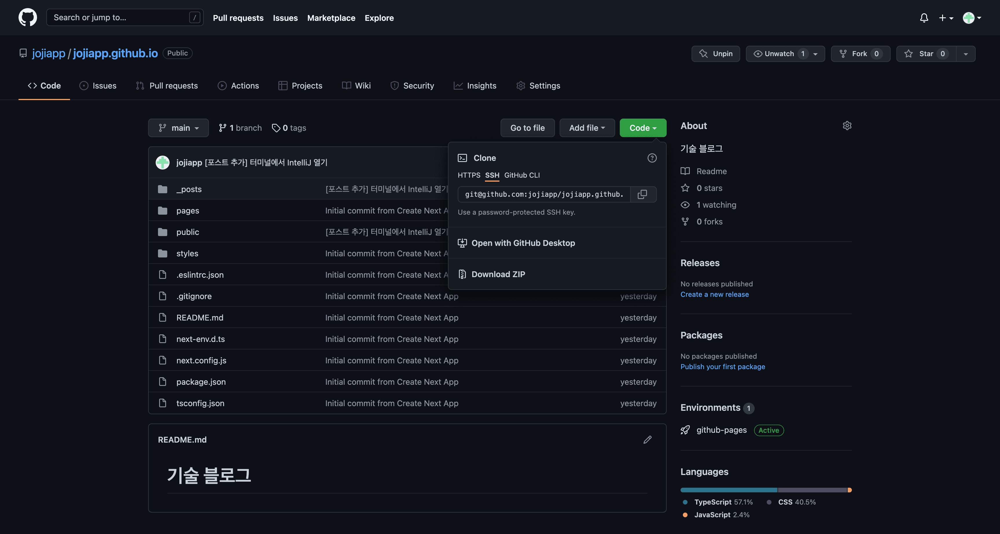

> GitHub를 원격저장소로 Repository를 사용할 경우 기본적으로 HTTPS로 접속하게 됩니다.  
> 이 경우 SSH를 사용할 때 보다는 보안이 좋지 않습니다.  
> 또한, 매번 아이디 및 패스워드를 입력해야하는 번거로움이 있습니다.
>
> SSH를 이용하면 HTTPS보다 보안도 좋고, 매번 아이디 및 비밀번호를 입력해야하는 수고를 덜수 있습니다.

## SSH 키 확인

이미 SSH 키가 존재하는 상태에서 다시 발급 시, 기존의 키가 덮어쓰기 되어버리기 때문에 SSH 키가 존재하는지 확인해야합니다.

당연히 다른 이름으로 SSH를 발급 할 수도 있습니다.

```zsh
~/.ssh
ls
```

- id_rsa (개인 키)
- id_rsa.pub (공개 키)

기본값으로 생성한 경우 위 두 파일이 있다면 이미 **발급을 한 경우**입니다.

## SSH 키 발급

```zsh
ssh-keygen -C "jojiapp@gmail.com" # 자신의 GitHub 이메일
```

해당 명령어는 SSH에서 사용할 3072bit RSA 키를 생성합니다.

```zsh
Enter file in which to save the key (~/.ssh/id_rsa):
```

Enter를 치시면 기본적으로 `~/.ssh` 경로에 SSH 파일(`id_rsa`, `id_rsa.pub`)이 생성되게 됩니다.  
다른 경로로 하고 싶으면 값을 입력하면 됩니다.

```zsh
Enter passphrase (empty for no passphrase):
Enter same passphrase again:
```

암호를 입력하여 보안을 더 강화할 수 있습니다.  
Enter를 치시면 기본적으로 암호를 생성하지 않습니다.

비밀번호를 입력 시, 해당 SSH키를 사용할 때마다 입력하여야 합니다.

```zsh
Your identification has been saved in ~/.ssh/id_rsa
Your public key has been saved in ~/.ssh/id_rsa.pub
```

위와 같은 문구가 나왔다면 SSH키가 발급 된 것입니다.

## ssh-agent 등록

`ssh-agent`에 개인키를 등록해 두면 `Git`이 `ssh-agent`에 등록되어 있는 개인키 정보를 사용하여 SSH 인증처리를 합니다.

그렇기 때문에 한 번 등록 해두면 매번 아이디 및 비밀번호를 입력할 필요가 없어지게 됩니다.

```zsh
eval "$(ssh-agent -s)"
ssh-add ~/.ssh/id_rsa # 위에서 생성한 SSH 개인키

Identity added: /Users/jojiapp/.ssh/id_rsa (jojiapp@gmail.com) # 해당 문구가 출력되면 등록 된 것입니다.
```

## ssh-agent 삭제

```zsh
ssh-add -D ~/.ssh/id_rsa
```

`-D` 옵션을 통해 ssh-agent에서 제거 할 수 있습니다.

## ssh-agent 조회

```zsh
ssh-add -l
```

## GitHub에 공개키 등록

SSH 인증방식은 로컬에 있는 개인키와 GitHub(원격저장소)에 있는 공개키를 이용해 인증을 처리하는 방식이기 때문에 Github(원격저장소)에 공개키를 등록해 주어야 합니다.







- Title: 해당 키 값을 구별할 수 있는 자신이 원하는 제목을 넣으면 됩니다.
- Key: 공개키를 넣어주면 됩니다.

```zsh
pbcopy <~/.ssh/id_rsa.pub # 공개키를 클립보드에 복사합니다.
```

## SSH로 사용하기



SSH로 선택 후, 해당 값을 복사하여 사용하면 됩니다.

## GitHub 계정 여러 개 사용하기

SSH 키 마다 계정을 매핑 시켜 사용할 수 있습니다.

> 이 경우, SSH Key의 이름을 id_rsa로 두기보단 특정 이름으로 지어주는것이 좋습니다.

### Config 등록

```zsh
vi /.ssh/config
```

```zsh
Host github.com-jojiapp # github.com-사용할 이름**
  HostName github.com # remote name
  IdentityFile ~/.ssh/id_rsa_jojiapp # ssh-key 파일 경로
  User jojiapp # GitHub 계정 이름
```

> GitHub계정에 따라 여러 개를 작성해주면 됩니다.

### 사용 방법

```zsh
git clone git@{Host}:{username}/{repository}.git
```

```zsh
git clone git@github.com-jojiapp:jojiapp/jojiapp.github.io.git
```

Git에서 복사 후 github.com 뒤에 Host에서 작성 한대로 -jojiapp(사용할 이름)을 추가해주면 됩니다.

## GitHub Commit 기록이 남지 않을 때

SSH를 이용하여 연결 후, 작업을 하고 푸쉬를 했는데 GitHub Commit 기록이 남지 않는 경우가 있습니다.

대부분의 경우 GitHub의 이메일과 로컬에서 사용중인 이메일이 달라서 생기는 이슈입니다.

### 이메일 확인

```zsh
Author: 조지헌 <jojiapp@jojiheon-ui-MacBookPro.local>
```

`git log`를 찍어보면 이메일 정보가 이상하게 되어있습니다.

위와 같다면 GitHub의 이메일과 다르기 때문에 Commit 기록이 남지 않는것 입니다.

> global로 설정 된 이메일이 있다면 해당 값을 사용하지만 설정하지 않았다면 위 처럼 나옵니다.

### 해결 방법

```zsh
git config user.email jojiapp@gmail.com
```

여러 개의 계정을 사용중일 경우 위 처럼 각 프로젝트마다 어떤 이메일을 사용하는지 설정해 주면 됩니다.

> global로 설정한 이메일보다 우선순위가 높습니다.

---

## 참고 사이트

- [SSH를 사용하여 Git 리포지토리 연결](https://docs.microsoft.com/ko-kr/azure/devops/repos/git/use-ssh-keys-to-authenticate?view=azure-devops)
- [github 접속을 https에서 ssh 접속으로 변경하기](https://velog.io/@igotoo/github-%EC%A0%91%EC%86%8D%EC%9D%84-https%EC%97%90%EC%84%9C-ssh-%EC%A0%91%EC%86%8D%EC%9C%BC%EB%A1%9C-%EB%B3%80%EA%B2%BD%ED%95%98%EA%B8%B0)
- [GitHub ssh key 생성하고 등록하고 사용하기](https://syung05.tistory.com/20)
- [맥북에서 GitHub 계정 여러개 사용하는 방법](https://somjang.tistory.com/entry/%EB%A7%A5%EB%B6%81%EC%97%90%EC%84%9C-GitHub-%EA%B3%84%EC%A0%95-%EC%97%AC%EB%9F%AC%EA%B0%9C-%EC%82%AC%EC%9A%A9%ED%95%98%EB%8A%94-%EB%B0%A9%EB%B2%95)