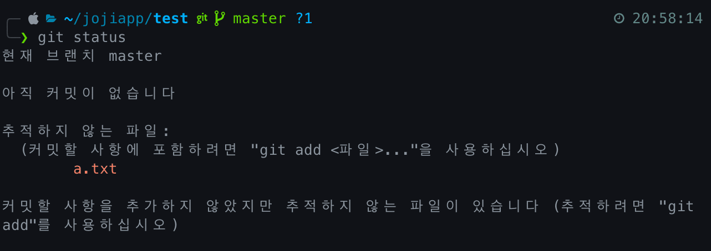
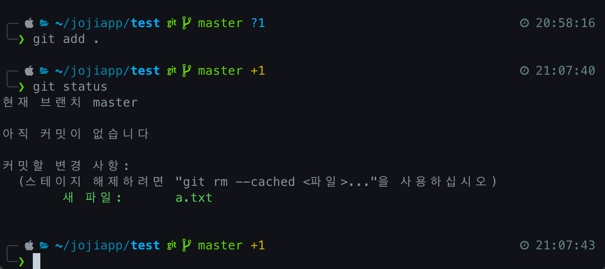
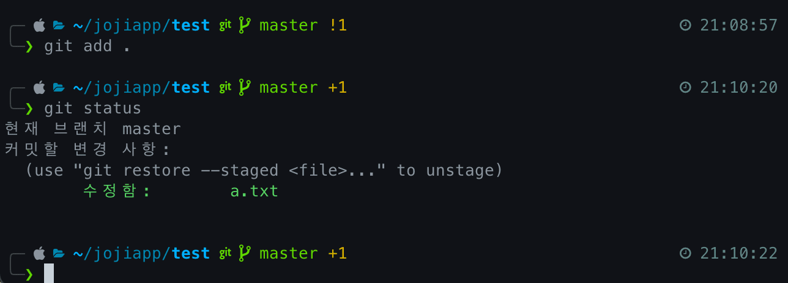

# [Git] Lifecycle

> Git을 제대로 이해하고 사용하기 위해서는 Lifecycle에 대해서 제대로 이해하고 있어야 합니다.  
> 어딜가도 사용하고 있는 Git의 Lifecycle을 제대로 알아봅시다.

> 출처: [2.2 Git의 기초 - 수정하고 저장소에 저장하기](https://git-scm.com/book/ko/v2/Git%EC%9D%98-%EA%B8%B0%EC%B4%88-%EC%88%98%EC%A0%95%ED%95%98%EA%B3%A0-%EC%A0%80%EC%9E%A5%EC%86%8C%EC%97%90-%EC%A0%80%EC%9E%A5%ED%95%98%EA%B8%B0)

`Git`은 크게 2가지 상태로 나뉩니다.

- `Untracked`: `Git`이 **관리(추적)하지 않는 상태**
- `Tracked`: `Git`이 **관리(추적)중인 상태**

여기서 `Tracked`는 또 3가지 상태로 나뉩니다.

- `Unmodified`: `commit`이후 **변경 되지 않은 상태**
- `Modified`: `commit`이후 **변경이 일어난 상태**
- `Staged`: `commit`이 **가능한 상태**

## Untracked

`Untracked` 상태는 한번도 `Staged` 상태에서 `commit`된 적이 없었던 파일로, 대부분 새로운 파일 생성 시 나타나는 상태입니다.

`git add` 명령어를 통해 `Staged` 상태로 변경할 수 있습니다.

## Unmodified

`Unmodified` 상태는 `commit` 이후 변경 된 사항이 없는 파일들을 의미합니다.

## Modified

`Modified` 상태는 `commit` 이후 변경 된 사항이 있는 파일을 의미합니다.

`수정함`이라고 쓰여있는 곳이 `commit` 이후 변경 사항이 생긴 파일입니다.

`git add` 명령어를 통해 `Staged` 상태로 변경할 수 있습니다.

`git add` 명령어를 통해 `Staged` 상태로 변경된 파일을 또 한 번 변경 후, 상태를 확인해보면 `Staged` 상태와 `Modified` 2가지 상태로 공존합니다.

`Staged` 상태에 있는 파일과 `Modified` 상태에 있는 파일은 내용이 다른 파일로, `commit`시 `Staged` 상태에 있는 파일이 `commit` 됩니다.

## Staged

`Staged` 상태는 `commit`이 가능한 파일들을 의미합니다.

`Untracked` 상태 및 `Modified` 상태인 파일들을 `git add` 명령어를 통해 `Staged` 상태로 만들 수 있습니다.

`Staged` 상태인 파일들만 `commit`됩니다.
