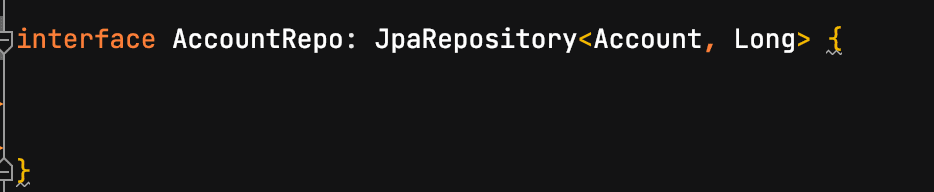
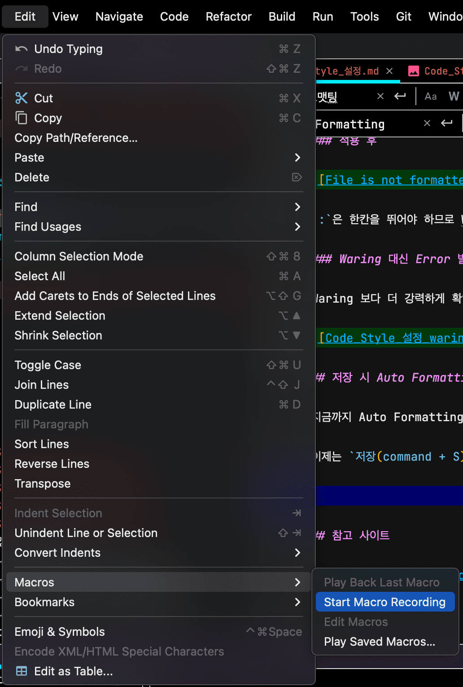
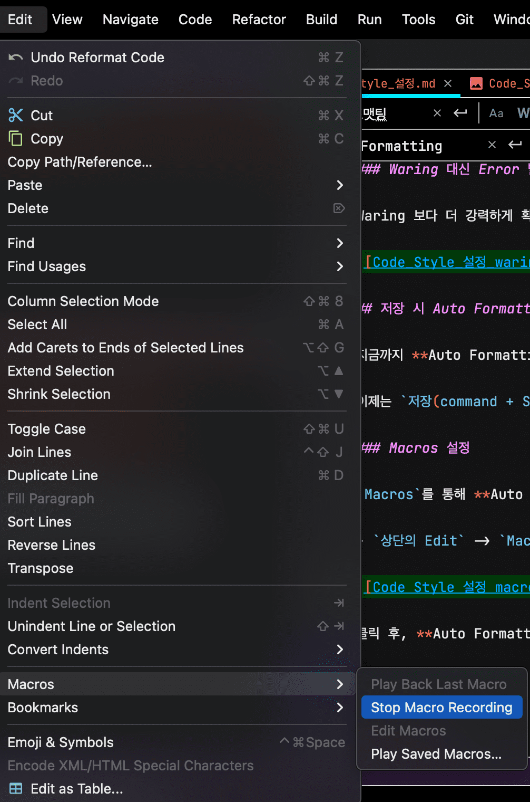
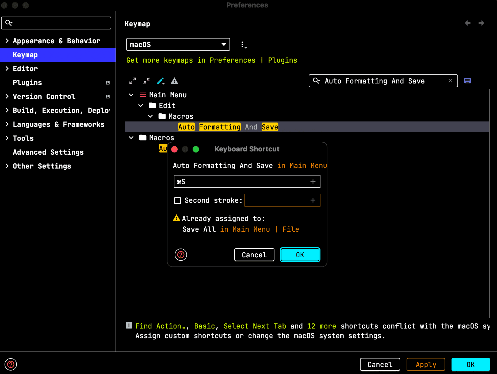

# [IntelliJ] Code Style 설정

> 혼자서 개발을 진행 할 때는 들여쓰기가 2개든 4개든 상관이 없습니다. 하지만, 여러 명에서 같이 작업을 하게 된다면 문제가 됩니다.
>
> 각자의 스타일이 다 다르기 때문에 코드가 눈에 잘 안들어오기도 할 뿐더러,
> Auto Formatting을 설정해 놓았다면 설정 해놓은 코드 스타일대로 변경이 되면서
> 변경된 것도 없는데 Git에 변경된 걸로 감지 되게 됩니다.  
> 그런 상태로 Pull Request를 요청하게 되면 실제 코드가 변경된 파일과 스타일만 변경된 파일을 구분하기가 쉽지 않습니다.
>
> 이런 경우를 방지 하고자 코드스타일을 맞추고 개발을 진행하게 됩니다.  
> 언어마다 다르지만 보통 특정 회사(Google, Airbnb 등)의 코드 스타일을 따라 갑니다.
>
> IntelliJ에서는 그런 설정을 쉽게 할 수 있도록 지원합니다.

## Code Style 적용

저는 `Kotlin`을 사용하고 있기 때문에 `Kotlin`을 적용하지만, 다른 언어들도 동일하게 적용하면 됩니다.

- Preference -> Editor -> Code Style -> Kotlin -> Set From -> Kotlin style guide

> **Kotlin style guide**: [Kotlin 공식 사이트](https://kotlinlang.org/docs/coding-conventions.html) 에서 제공하는 컨벤션 입니다.

**Auto Formatting**(`option + command + L`)을 해보면 적용 된 걸 알 수 있습니다.

## Auto Formatting 전에 잘못 된 부분 확인하기

- `Preference` -> `Editor` -> `Inspections` -> `Kotlin` ->  
  `Style issues -> File is not formatted according to project settings` 체크

해당 프로젝트가 아닌 IDE 전체에 적용하고 싶다면 `Profile`을 `Stored In IDE` -> `Default`로 선택 한 뒤 설정 하면 됩니다.

### 적용 전

### 적용 후

`:`은 한칸을 뛰어야 하므로 Waring이 발생한 걸 볼수 있습니다.

### Waring 대신 Error 발생으로 만들기

Waring 보다 더 강력하게 확인하기 위해서 Error로 변경하려면 `Severity`을 변경해주시면 됩니다.

## 저장 시 Auto Formatting 되도록 설정

지금까지 **Auto Formatting** 후 **저장**을 하기 위해서는 `option + command + L`을 누른 후 `command + S`를 눌러야 했습니다.

이제는 `저장(command + S)`만 눌러도 Auto Formatting 후 저장이 되도록 설정해 보겠습니다.

### Macros 설정

`Macros`를 통해 **Auto Formatting**과 **저장**을 하나로 묶어 줍니다.

- `상단의 Edit` -> `Macros` -> `Start Macro Recording`

클릭 후, **Auto Formatting** 후 **저장**을 눌러 녹화해 준 뒤 녹화를 정지합니다.

- `option + command + L` -> `command + S` -> `Stop Macro Recording`

- 해당 녹화본에 대해 원하는 이름을 설정합니다.

### 키 매핑

- `Preference` -> `Keymap` -> `Auto Formatting And Save(위에서 설정한 이름) 입력` ->`Add KeyBoard Shortcut` ->
  `command + S` -> `Save` -> `Remove(기존에 command + S 를 사용중이던 키 매핑을 삭제합니다)`

이후, `저장(command + S)`를 해보면 **Auto Formatting** 후 **저장**이 됩니다.

---

## 참고 사이트

- [IntelliJ Kotlin Code Style 설정법](https://velog.io/@lsb156/IntelliJ-Kotlin-Code-Style-%EC%84%A4%EC%A0%95%EB%B2%95)