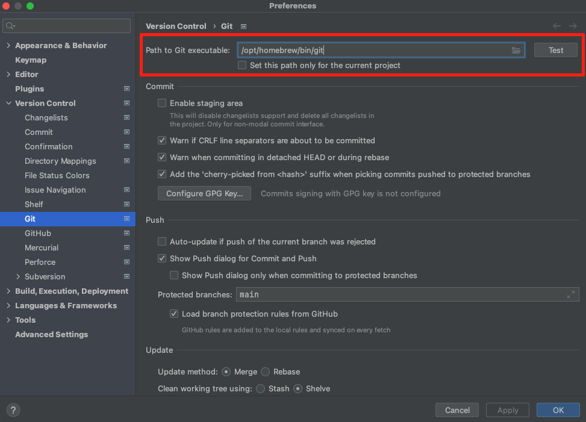

# [Intellij] Git 설정

> IntelliJ는 기본적으로 Git을 내장하고 있기 때문에 로컬에 설치한 Git과 버전이 다를수 있습니다.  
> 이럴 경우, 로컬에 설치한 Git을 사용하도록 설정을 바꿔주면 됩니다.

## IntelliJ에서 Git 설정 하기



1. 설정
2. Version Control
3. Git
4. Path to Git executable: 로컬 Git 위치 입력

## Mac의 경우 Git 설치 위치 조회

Mac OS의 경우 Which 키워드를 통해 설치된 위치를 조회할 수 있습니다.

```zsh
which git
```