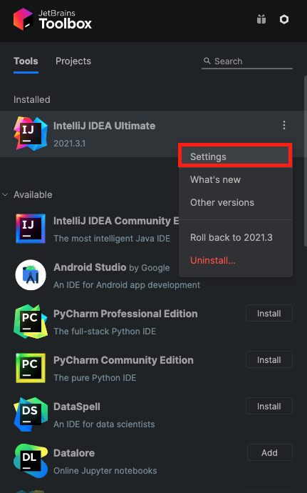
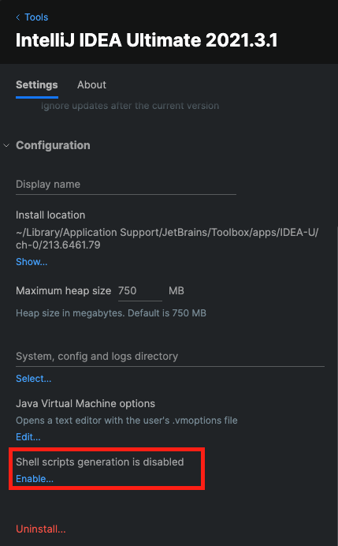
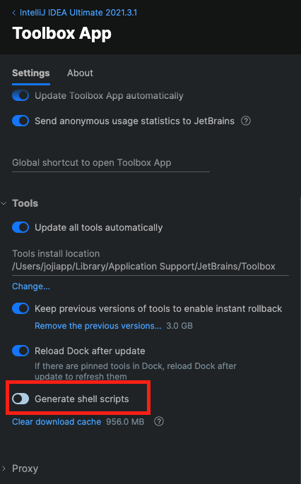
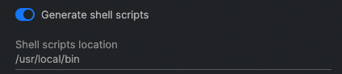

# [IntelliJ] 터미널에서 IntelliJ 열기

> IntelliJ를 앱을 직접 클릭하여 열기 보다 조금 더 프로그래머(?)스럽게 Command Line으로 IntelliJ를 실행 하는 방법을 알아보겠습니다.

## ToolBox 설치

예전에는 IntelliJ안에서도 설정이 가능했지만, 이제는 ToolBox를 사용하여 하도록 변경되었습니다.  
그렇기 때문에 ToolBox를 설치합니다.

[ToolBox 설치 사이트](https://www.jetbrains.com/ko-kr/toolbox-app/)

## 설정



IntelliJ -> Settings 클릭



Configuration -> Shell scripts generation is disabled -> Enable 클릭



제일 아래에 Generate shell scripts를 켜줍니다.



해당 경로로 들어가 idea 라는 Shell script 파일이 생성 되어 있다면 정상적으로 된 것입니다.

## Command Line으로 IntelliJ 실행

```zsh
idea 경로 # .의 경우 현재 폴더
```