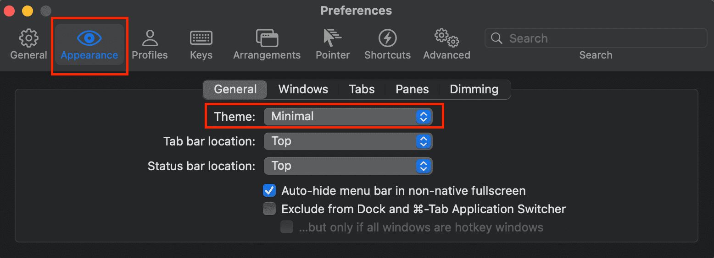
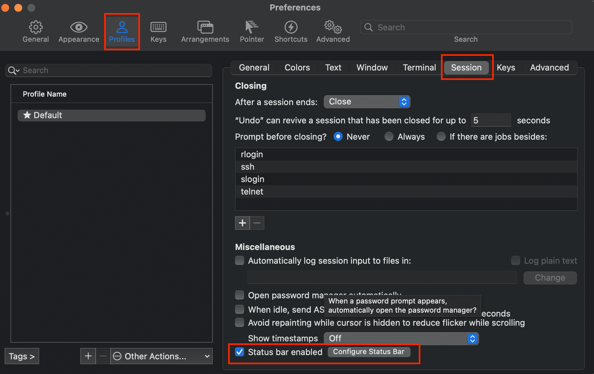
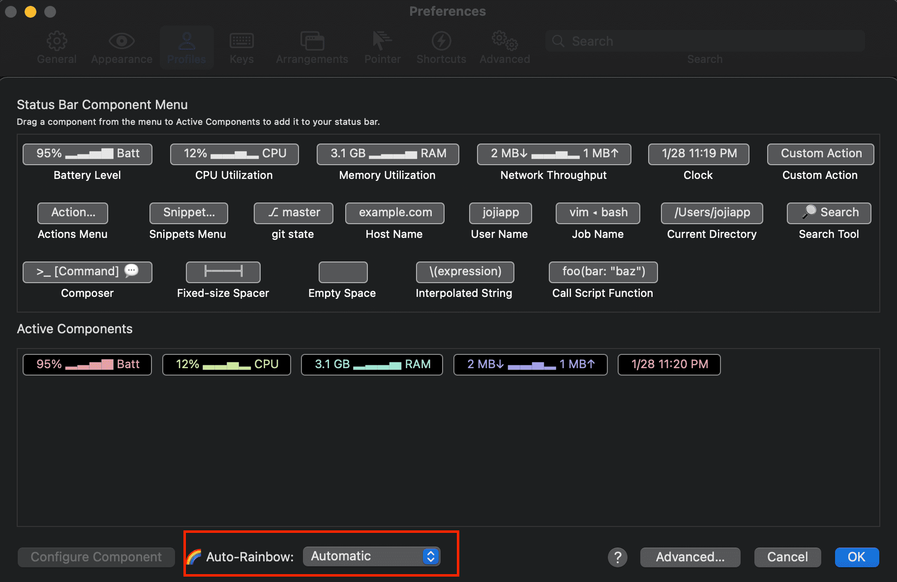
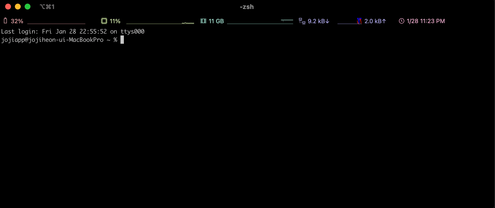

> 맥북에 기본적으로 설치 된 터미널은 v10.15(카탈리나)이후 부터 zsh 쉘을 기본적으로 사용할 수 있습니다.  
> 하지만, iTerm2를 설치하면 더 다양한 기능과 커스텀을 할 수 있으므로 iTerm2를 설치하여 터미널을 이쁘게 꾸며보겠습니다.

## iTerm2 설치

- `iterm`을 `homebrew`를 통해 검색합니다.

```zsh
brew search iterm
```

```zsh
==> Formulae
term                xterm               dterm               aterm

==> Casks
iterm2
```

- 이 중 `Casks`의 `iterm2`를 설치하면 됩니다.

```zsh
brew install --cask iterm2
```

## 기본적인 터미널 커스텀

- `Preferences` -> `Appearance` -> `theme`를 `Minimal`로 변경 (자신이 원하는 걸로 하면 됩니다.)



- `Preferences` -> `Profiles` -> `Session` -> `Status bar enabled 체크` -> `Configure Status Bar`



- 원하는 기능들을 `밑으로 드래그` -> 하단의 `Auto-Rainbow에서 원하는 색상 입히기`



- 터미널 상단에 보면 이쁘게 기능들이 추가되어 있습니다.



---

## 참고 사이트

- [노마드 코더 개발환경 셋팅 유튜브](https://www.youtube.com/watch?v=B26yiuC5zPM&t=463s)